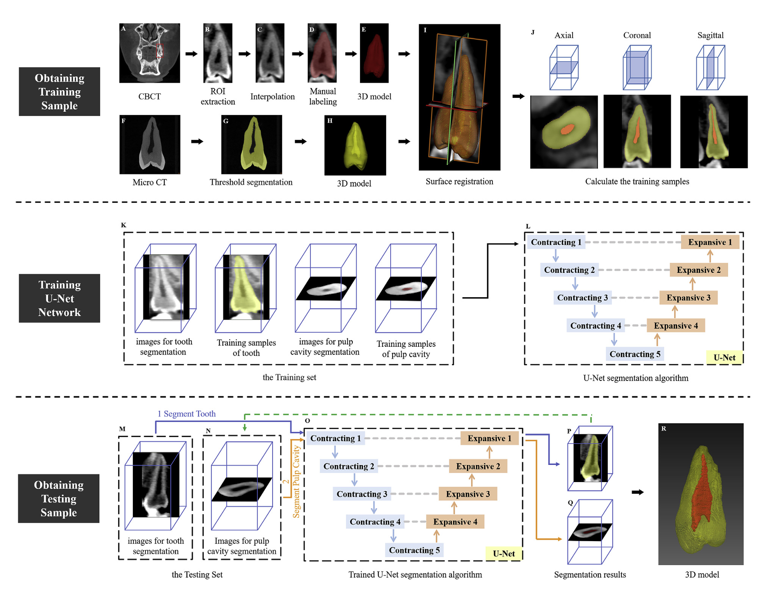
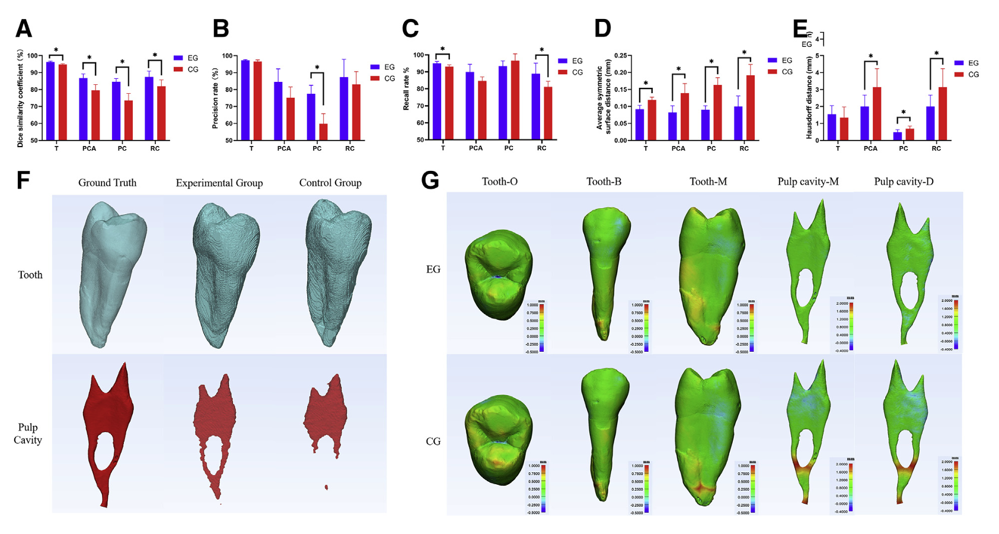

# ToothPulpVision3D
## Paper:  [Micro–Computed Tomography–Guided Artificial Intelligence for Pulp Cavity and Tooth Segmentation on Cone-beam Computed Tomography](https://www.sciencedirect.com/science/article/pii/S0099239921006427) 
## code:  https://github.com/PhilChina/ToothPulpVision3D

